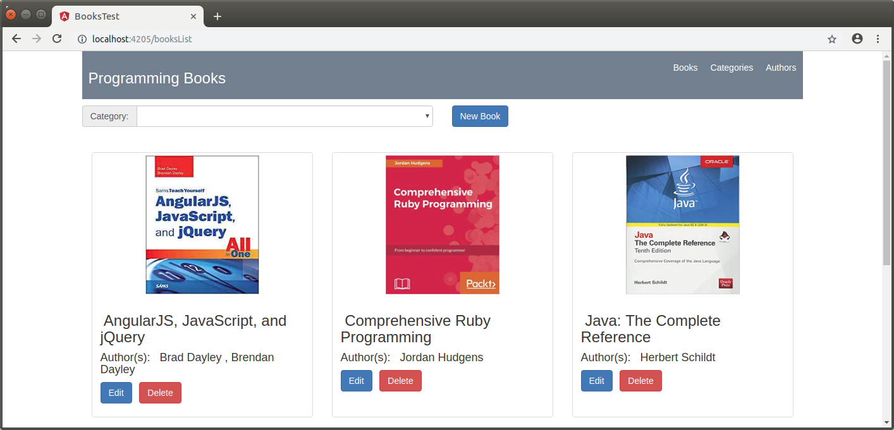
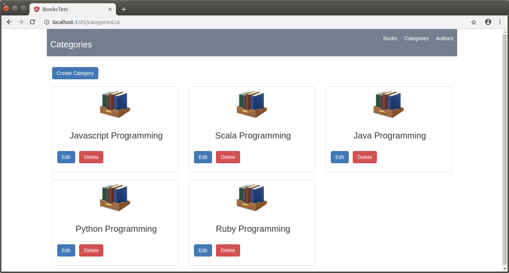
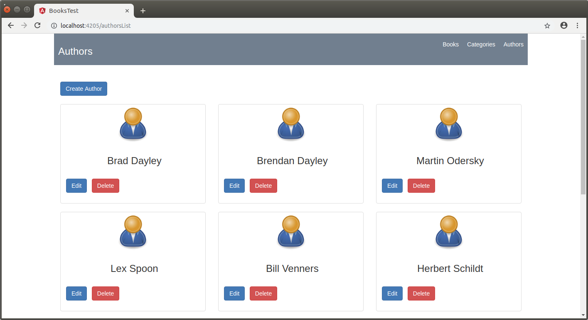

Bookstore REST Client
------------------------------------------------------------------------------------------------------------------------

Aplicación de ejemplo desarrollada con Angular 7 y Bootstrap que permite crear categorias, autores y libros
utilizando como backend la api Bookstore REST API (https://github.com/edgar-code-repository/spring-boot-rest-books.git)

------------------------------------------------------------------------------------------------------------------------

Pantalla principal de vista books:

------------------------------------------------------------------------------------------------------------------------

Pantalla principal de vista categories:

------------------------------------------------------------------------------------------------------------------------

Pantalla principal de vista authors:

------------------------------------------------------------------------------------------------------------------------

Github URL: https://github.com/edgar-code-repository/angular-books-app.git

------------------------------------------------------------------------------------------------------------------------
